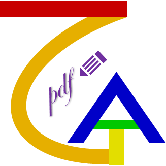

<div align="center"></div>

# ZgaPdfSigner


A javascript tool to sign a pdf or set protection of a pdf in web browser.  
And it is more powerful when used in [Google Apps Script](https://developers.google.com/apps-script) or [nodejs](https://nodejs.org/).  

PS: __ZGA__ is the abbreviation of my father's name.  
And I use this name to hope the merits from this application will be dedicated to my parents.

## Main features

* Sign a pdf with an invisible pkcs#7 signature.
* Sign a pdf with a visible pkcs#7 signature by drawing an image or a text or both.
* A visible signature can be placed on multiple pages. (In the same position)
* Sign a pdf and set [DocMDP](https://github.com/zboris12/zgapdfsigner/wiki/API#note).
* Add a new signature to a pdf if it has been signed already. (An incremental update)
* Add a document timestamp from [TSA](https://github.com/zboris12/zgapdfsigner/wiki/API#note). ( :no_entry_sign:__Not__ available in web browser)
* Sign a pdf with a timestamp from [TSA](https://github.com/zboris12/zgapdfsigner/wiki/API#note). ( :no_entry_sign:__Not__ available in web browser)
* Enable signature's [LTV](https://github.com/zboris12/zgapdfsigner/wiki/API#note). ( :no_entry_sign:__Not__ available in web browser)
* Set password protection to a pdf. Supported algorithms:
  * 40bit RC4 Encryption
  * 128bit RC4 Encryption
  * 128bit AES Encryption
  * 256bit AES Encryption
* Set public-key certificate protection to a pdf.
  Supported algorithms are as same as the password protection.

## About signing with [TSA](https://github.com/zboris12/zgapdfsigner/wiki/API#note) and [LTV](https://github.com/zboris12/zgapdfsigner/wiki/API#note)

Because of the [CORS](https://github.com/zboris12/zgapdfsigner/wiki/API#note) security restrictions in web browser,
signing with a timestamp from [TSA](https://github.com/zboris12/zgapdfsigner/wiki/API#note) or enabling [LTV](https://github.com/zboris12/zgapdfsigner/wiki/API#note) can only be used in [Google Apps Script](https://developers.google.com/apps-script) or [nodejs](https://nodejs.org/).

## The Dependencies

* [pdf-lib](https://pdf-lib.js.org/)
* [node-forge](https://github.com/digitalbazaar/forge)
* [follow-redirects](https://github.com/follow-redirects/follow-redirects)

## How to use this tool

:question: For more details please see the [wiki](https://github.com/zboris12/zgapdfsigner/wiki/API).

### Web Browser
Just import the dependencies and this tool.
```html
<script src="https://unpkg.com/pdf-lib@1.17.1/dist/pdf-lib.min.js" type="text/javascript"></script>
<script src="https://unpkg.com/node-forge@1.3.1/dist/forge.min.js" type="text/javascript"></script>
<script src="https://cdn.jsdelivr.net/npm/zgapdfsigner/dist/zgapdfsigner.min.js" type="text/javascript"></script>
```
When drawing text by non-standard font, importing the fontkit library is necessary.
```html
<script src="https://unpkg.com/@pdf-lib/fontkit/dist/fontkit.umd.min.js" type="text/javascript"></script>
```

### [Google Apps Script](https://developers.google.com/apps-script)
Load the dependencies and this tool.
```js
// Simulate setTimeout function for pdf-lib
function setTimeout(func, sleep){
  Utilities.sleep(sleep);
  func();
}
// Simulate window for node-forge
var window = globalThis;
// Load pdf-lib
eval(UrlFetchApp.fetch("https://unpkg.com/pdf-lib@1.17.1/dist/pdf-lib.min.js").getContentText());
// It is necessary for drawing text by non-standard font.
eval(UrlFetchApp.fetch("https://unpkg.com/@pdf-lib/fontkit/dist/fontkit.umd.min.js").getContentText());
// Load node-forge
eval(UrlFetchApp.fetch("https://unpkg.com/node-forge@1.3.1/dist/forge.min.js").getContentText());
// Load ZgaPdfSigner
eval(UrlFetchApp.fetch("https://cdn.jsdelivr.net/npm/zgapdfsigner/dist/zgapdfsigner.min.js").getContentText());
```
Or simply import the library of [ZgaPdfToolkit](https://script.google.com/macros/library/d/1T0UPf50gGp2fJ4dR1rZfEFgKYC5VpCwUVooCRNySiL7klvIUVsFBCZ9m/7)
1. Add the library of ZgaPdfToolkit to your project, and suppose the id of library you defined is "pdfkit".  
   Script id: `1T0UPf50gGp2fJ4dR1rZfEFgKYC5VpCwUVooCRNySiL7klvIUVsFBCZ9m`
2. Load the library.
```js
pdfkit.loadZga(globalThis);
```

### [nodejs](https://nodejs.org/)
1. Install
```
npm install zgapdfsigner
```
2. Import
```js
const Zga = require("zgapdfsigner");
```

## Let's sign

Sign with an invisible signature.

```js
/**
 * @param {ArrayBuffer} pdf
 * @param {ArrayBuffer} cert
 * @param {string} pwd
 * @return {Promise<Blob>}
 */
async function sign1(pdf, cert, pwd){
  /** @type {SignOption} */
  var sopt = {
    p12cert: cert,
    pwd: pwd,
    permission: 1,
  };
  var signer = new Zga.PdfSigner(sopt);
  var u8arr = await signer.sign(pdf);
  return new Blob([u8arr], {"type" : "application/pdf"});
}
```

Sign with a visible signature of an image.

```js
/**
 * @param {ArrayBuffer} pdf
 * @param {ArrayBuffer} cert
 * @param {string} pwd
 * @param {ArrayBuffer} imgdat
 * @param {string} imgtyp
 * @return {Promise<Blob>}
 */
async function sign2(pdf, cert, pwd, imgdat, imgtyp){
  /** @type {SignOption} */
  var sopt = {
    p12cert: cert,
    pwd: pwd,
    drawinf: {
      area: {
        x: 25,  // left
        y: 150, // top
        w: 60,  // width
        h: 60,  // height
      },
      imgInfo: {
        imgData: imgdat,
        imgType: imgtyp,
      },
    },
  };
  var signer = new Zga.PdfSigner(sopt);
  var u8arr = await signer.sign(pdf);
  return new Blob([u8arr], {"type" : "application/pdf"});
}
```

Sign with a visible signature by drawing a text.

```js
/**
 * @param {ArrayBuffer} pdf
 * @param {ArrayBuffer} cert
 * @param {string} pwd
 * @param {string} txt
 * @param {ArrayBuffer} fontdat
 * @return {Promise<Blob>}
 */
async function sign3(pdf, cert, pwd, txt, fontdat){
  /** @type {SignOption} */
  var sopt = {
    p12cert: cert,
    pwd: pwd,
    drawinf: {
      area: {
        x: 25,  // left
        y: 150, // top
        w: 60,  // width
        h: 60,  // height
      },
      textInfo: {
        text: txt,
        fontData: fontdat,
        color: "#00f0f1",
        size: 16,
      },
    },
  };
  var signer = new Zga.PdfSigner(sopt);
  var u8arr = await signer.sign(pdf);
  return new Blob([u8arr], {"type" : "application/pdf"});
}
```

Use it in [Google Apps Script](https://developers.google.com/apps-script)

```js
/**
 * @param {string} pwd Passphrase of certificate
 * @return {Promise}
 */
async function createPdf(pwd){
  // Load pdf, certificate
  var pdfBlob = DriveApp.getFilesByName("_test.pdf").next().getBlob();
  var certBlob = DriveApp.getFilesByName("_test.pfx").next().getBlob();
  // Sign the pdf
  /** @type {SignOption} */
  var sopt = {
    p12cert: certBlob.getBytes(),
    pwd,
    signdate: "1",
    ltv: 1,
  };
  var signer = new Zga.PdfSigner(sopt);
  var u8arr = await signer.sign(pdfBlob.getBytes());
  // Save the result pdf to some folder
  var fld = DriveApp.getFolderById("a folder's id");
  fld.createFile(Utilities.newBlob(u8arr, "application/pdf").setName("signed_test.pdf"));
}
```

Use queryPassword function in [ZgaPdfToolkit](https://script.google.com/macros/library/d/1T0UPf50gGp2fJ4dR1rZfEFgKYC5VpCwUVooCRNySiL7klvIUVsFBCZ9m/5).

```js
function myfunction(){
  var spd = SpreadsheetApp.getActiveSpreadsheet();
  pdfkit.queryPassword("createPdf", "Please input the passphrase", spd.getName());
}
```

Use it in [nodejs](https://nodejs.org/)
```js
const m_fs = require("fs");
const m_path = require("path");
async function main(){
  /** @type {string} */
  var pdfPath = m_path.join(__dirname, "_test.pdf");
  /** @type {string} */
  var pfxPath = m_path.join(__dirname, "_test.pfx");
  /** @type {string} */
  var ps = "";
  /** @type {string} */
  var imgPath = m_path.join(__dirname, "_test.png");
  /** @type {string} */
  var txt = "I am a test string!";
  /** @type {string} */
  var fontPath = m_path.join(__dirname, "_test.ttf");

  if(process.argv.length > 3){
    pfxPath = process.argv[2];
    ps = process.argv[3];
  }else if(process.argv[2]){
    ps = process.argv[2];
  }

  if(!ps){
    // throw new Error("The passphrase is not specified.");
    pfxPath = "";
  }

  /** @type {Buffer} */
  var pdf = m_fs.readFileSync(pdfPath);
  /** @type {Buffer} */
  var pfx = null;
  if(pfxPath){
    pfx = m_fs.readFileSync(pfxPath);
  }
  /** @type {Buffer} */
  var img = null;
  /** @type {string} */
  var imgType = "";
  if(imgPath){
    img = m_fs.readFileSync(imgPath);
    imgType = m_path.extname(imgPath).slice(1);
  }
  /** @type {Buffer} */
  var font = null;
  if(fontPath){
    font = m_fs.readFileSync(fontPath);
  }

  /** @type {SignOption} */
  var sopt = {
    p12cert: pfx,
    pwd: ps,
    permission: pfx ? 2 : 0,
    signdate: "1",
    reason: "I have a test reason.",
    location: "I am on the earth.",
    contact: "zga@zga.com",
    ltv: 1,
    debug: true,
  };
  if(img || txt){
    sopt.drawinf = {
      area: {
        x: 25, // left
        y: 50, // top
        w: txt ? undefined : 60,
        h: txt ? undefined : 100,
      },
      pageidx: "2-3", // Placed the signature on the 3rd page and the 4th page. (Indexes of pages start from 0)
      imgInfo: img ? {
        imgData: img,
        imgType: imgType,
      } : undefined,
      textInfo: txt ? {
        text: txt,
        fontData: font,
        size: 16,
      } : undefined,
    };
  }

  /** @type {Zga.PdfSigner} */
  var ser = new Zga.PdfSigner(sopt);
  /** @type {Uint8Array} */
  var u8dat = await ser.sign(pdf);

  if(u8dat){
    /** @type {string} */
    var outPath = m_path.join(__dirname, "test_signed.pdf");
    m_fs.writeFileSync(outPath, u8dat);
    console.log("Output file: " + outPath);
  }

  console.log("Done");
}
```

## Let's protect the pdf

Set password protection to the pdf.

```js
/**
 * @param {ArrayBuffer} pdf
 * @param {string} upwd
 * @param {string} opwd
 * @return {Promise<Blob>}
 */
async function protect1(pdf, upwd, opwd){
  /** @type {EncryptOption} */
  var eopt = {
    mode: Zga.Crypto.Mode.RC4_40,
    permissions: ["modify", "annot-forms", "fill-forms", "extract", "assemble"],
    userpwd: upwd,
    ownerpwd: opwd,
  };
  var cyptor = new Zga.PdfCryptor(eopt);
  var pdfdoc = await cyptor.encryptPdf(pdf);
  u8arr = await pdfdoc.save({"useObjectStreams": false});
  return new Blob([u8arr], {"type" : "application/pdf"});
}
```

Set public-key certificate protection to the pdf.

```js
/**
 * @param {ArrayBuffer} pdf
 * @param {ArrayBuffer} cert
 * @return {Promise<Blob>}
 */
async function protect2(pdf, cert){
  /** @type {EncryptOption} */
  var eopt = {
    mode: Zga.Crypto.Mode.AES_128,
    pubkeys: [{
      c: cert,
      p: ["copy", "modify", "copy-extract", "annot-forms", "fill-forms", "extract", "assemble"],
    }],
  };
  var cyptor = new Zga.PdfCryptor(eopt);
  var pdfdoc = await cyptor.encryptPdf(pdf);
  u8arr = await pdfdoc.save({"useObjectStreams": false});
  return new Blob([u8arr], {"type" : "application/pdf"});
}
```

Sign and set protection.

```js
/**
 * @param {ArrayBuffer} pdf
 * @param {ArrayBuffer} cert
 * @param {string} pwd
 * @param {string} opwd
 * @return {Promise<Blob>}
 */
async function signAndProtect1(pdf, cert, pwd, opwd){
  /** @type {SignOption} */
  var sopt = {
    p12cert: cert,
    pwd: pwd,
  };
  /** @type {EncryptOption} */
  var eopt = {
    mode: Zga.Crypto.Mode.RC4_128,
    permissions: ["modify", "annot-forms", "fill-forms", "extract", "assemble"],
    ownerpwd: opwd,
  };
  var signer = new Zga.PdfSigner(sopt);
  var u8arr = await signer.sign(pdf, eopt);
  return new Blob([u8arr], {"type" : "application/pdf"});
}
```

Sign and set protection by the same certificate.

```js
/**
 * @param {ArrayBuffer} pdf
 * @param {ArrayBuffer} cert
 * @param {string} pwd
 * @return {Promise<Blob>}
 */
async function signAndProtect2(pdf, cert, pwd){
  /** @type {SignOption} */
  var sopt = {
    p12cert: cert,
    pwd: pwd,
  };
  /** @type {EncryptOption} */
  var eopt = {
    mode: Zga.Crypto.Mode.AES_256,
    permissions: ["modify", "annot-forms", "fill-forms", "extract", "assemble"],
    pubkeys: [],
  };
  var signer = new Zga.PdfSigner(sopt);
  var u8arr = await signer.sign(pdf, eopt);
  return new Blob([u8arr], {"type" : "application/pdf"});
}
```

## Thanks
* The module of setting protection was almost migrated from [TCPDF](http://www.tcpdf.org).

## License

This tool is available under the
[MIT license](https://opensource.org/licenses/MIT).
